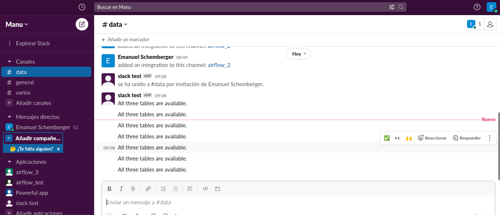

# README for snowflake_airflow_data_analysis_automation

This project demonstrates the automation of data analysis tasks using Apache Airflow and Snowflake. The goal is to create a DAG that automatically creates new tables with different names every 15 minutes.

## Requirements

- Apache Airflow
- Snowflake account
- Slack account (optional)
- Apache NiFi (optional)

## Screenshots

Here are some screenshots that demonstrate the functionality of the proyect:

- The CSV files are loaded into Snowflake:

- Tables are created with different names:

- The DAG runs successfully:

- Slack alerts are generated(optional):

## Bonus Features

- The processed tables can be sent to an S3 bucket using Apache NiFi.
- Slack alerts.
- The course on Apache Airflow by Marc Lamberti can be used to learn key concepts.
- The DAG can be modified to work with a different dataset.

## Conclusion

This project demonstrates how Apache Airflow and Snowflake can be used together to automate data analysis tasks. The DAG created here can be modified and extended to work with other datasets and perform more complex operations. The bonus features provide additional functionality that can be useful in a real-world setting.
